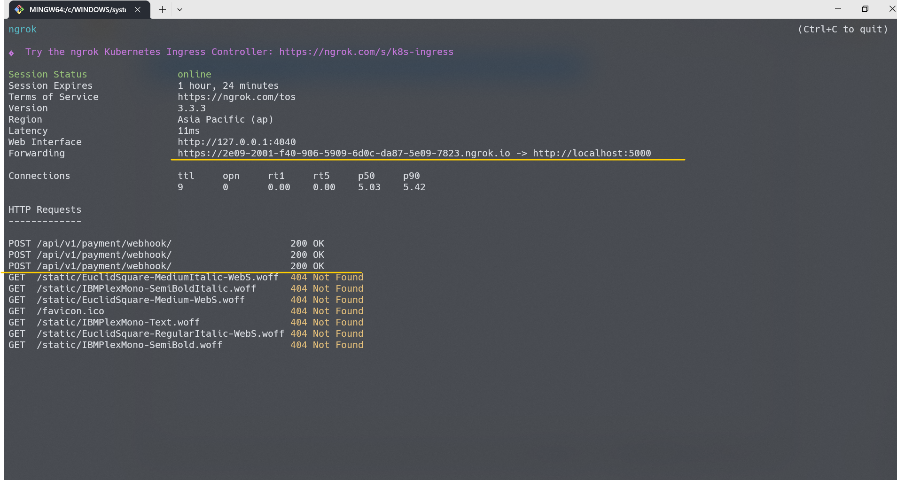

## Quick Start

Clone the repo:

```bash
git clone https://github.com/zhuolisam/arrivo.git
npm install
cp .env.example .env
```

Recommended way:
Before you proceed, please create a database called blog-app, and replaced necessary credentials in .env DATABASE_URL

```
node seed/init.js     //initialise database tables
node seed/seeder.js   //initialise mock data

npm run start
```

After testing everything

```
node seed/cleanup.js //destory database
```

Or docker way:

```bash
docker-compose up --build
```

## Features

- **PostgreSQL database**: using [pg-promise](https://github.com/vitaly-t/pg-promise)
- **Authentication and authorization**: using JWT Access Token
- **Validation**: request data validation using [Joi](https://github.com/hapijs/joi)
- **Error handling**: centralized error handling mechanism
- **CORS**: Cross-Origin Resource-Sharing enabled using [cors](https://github.com/expressjs/cors)
- **Compression**: gzip compression with [compression](https://github.com/expressjs/compression)
- **Docker support**
- **Git hooks**: with [husky](https://github.com/typicode/husky) and [lint-staged](https://github.com/okonet/lint-staged)
- **Linting**: with [ESLint](https://eslint.org) and [Prettier](https://prettier.io)

## Project Structure

```
src\
 |--config\         # Environment variables and configuration related things
 |--controllers\    # Route controllers (controller layer)
 |--db\             # Database connection
 |--middlewares\    # Custom express middlewares
 |--models\         # PostgreSQL queries (data layer)
 |--routers\        # Routes
 |--utils\          # Utility classes and functions
 |--validations\    # Request data validation schemas
 |--server.js       # Express app
```

### API Endpoints

List of available routes:

**Auth routes**:\
`POST api/v1/auth/register` - register\
`POST api/v1/auth/login` - login

**User routes**:\
`POST api/v1/users` - create a user\
`GET api/v1/users` - get all users\
`GET api/v1/users/:userId` - get user\
`PATCH api/v1/users/:userId` - update user\
`DELETE api/v1/users/:userId` - delete user

**Category routes**:\
`POST api/v1/categories` - create a new category\
`GET api/v1/categories` - get all categories\
`GET api/v1/categories/:categoryId` - get category by ID\
`PATCH api/v1/categories/:categoryId` - update category by ID\
`DELETE api/v1/categories/:categoryId` - delete category by ID

**Post routes**:\
`POST api/v1/posts` - create a new post\
`GET api/v1/posts` - get all posts\
`GET api/v1/posts/:postId` - get post by ID\
`PATCH api/v1/posts/:postId` - update post by ID\
`DELETE api/v1/posts/:postId` - delete post by ID

**Payment routes**:\
`POST api/v1/payment/` - create a new payment for premium membership\
`POST api/v1/payment/webhook` - webhook for Billplz updates

*For all the required params and body inputs, please visit the `validations\` folder*

## Notes

1. All routes are protected, please login using admin, normal, premium to obtain the jwt token, include them in your subsequent call.

If you have seeded database properly, you can get the JWT token from output of these commands

```
curl -X POST \
  -H "Content-Type: application/json" \
  -d '{"email": "admin@example.com", "password": "adminpassword"}' \
  http://localhost:5000/api/v1/auth/login

curl -X POST \
  -H "Content-Type: application/json" \
  -d '{"email": "normal@example.com", "password": "normalpassword"}' \
  http://localhost:5000/api/v1/auth/login

curl -X POST \
  -H "Content-Type: application/json" \
  -d '{"email": "premium@example.com", "password": "premiumpassword"}' \
  http://localhost:5000/api/v1/auth/login

```

2. Payment service is unavailable since webhook URL is not available

3. In this project, I only used access token and they only live for 3 hours. In real world, we implements refresh token so that user can rotate access tokens.

## Demo
This demo shows the upgrading of normal user to premium user


My webhook endpoint works, there are incoming Billplz request hitting webhook (tunneling using ngrok)
